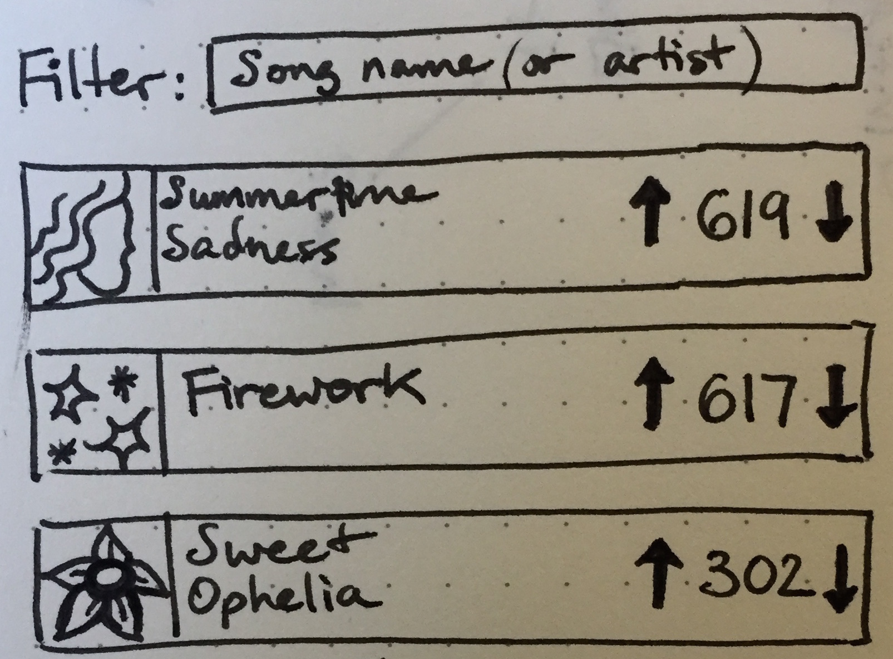

# Vevo front-end engineer test project

We're more interested in how you solve this problem, not what tools you use. Feel free to build it with other tools. What follows is a basic Express app that you can use.

## Getting Going with the Express app

_Tested with Mac OS X._

Assumes you've installed [NodeJS](http://nodejs.org/) and [git](http://git-scm.com/)

```sh

git clone https://github.com/vevo-arthur-klepchukov/html-eng-test
cd html-eng-test

# install depdendencies
npm install
# On Windows, if you receive an error like: "ENOENT, stat 'c:\Users\<username>\AppData\Roaming\npm"
# mkdir c:\Users\<username>\AppData\Roaming\npm

# run
npm start

# browse
open http://localhost:3003
```

## Your task, should you choose to accept it

### High-level
Our beta users have been clamoring for video voting. You're going to put together a prototype of the feature as sketched by the designer:



Integrate this into our site as you see best. _You don't have to follow this sketch!_

### Time
This straightforward task should take 2 - 4 hours. We expect your results 24 hours after sending it to you.

### Details
The Vevo API has provided us a sample list of 100 videos (__./topVideos.json__). 

1. Please display these videos when a user navigates to __/videos__. 
2. Sort the videos by the number of votes — from most votes to least.
3. Users should be able to vote for or against each video. You don't have to save these votes back to the Vevo API.
4. Since there's more than one screen of videos, please let the user filter the videos whichever way you think is best. 
5. Email your solution to [htmldevs@vevo.com](mailto:htmldevs@vevo.com) with directions to run it, if it differs from the Express app stub.

